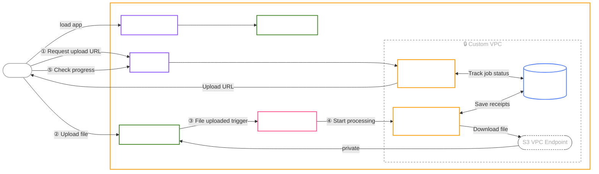

# Costco Receipt Tracker — Built on AWS

A full-stack web app for tracking Costco purchases deployed on AWS. Use the [Costco Receipts Downloader](https://chromewebstore.google.com/detail/costco-receipts-downloade/nnalnbomehfogoleegpfegaeoofheemn) Chrome extension to upload receipts, which get processed through an event-driven pipeline built on S3, SQS, Lambda, and RDS. The API and frontend are hosted on ECS. A planned LLM chat feature will let you query your purchase history conversationally.

## Architecture

### Receipt Upload Pipeline

Receipt uploads are handled asynchronously through an event-driven AWS pipeline. The client gets a presigned S3 URL, uploads directly to S3, and a Lambda function processes the file in the background while the UI polls for progress. All infrastructure is provisioned as code using Terraform.

> **Note:** Using a custom VPC with public subnets. A production setup would add private subnets and a NAT Gateway for full network isolation.

### LLM Chat *(coming soon)*

A planned conversational interface for querying your purchase history using an LLM.

## Tech Stack

### Languages

-  - Typed superset of JavaScript used across the full stack
-  - Markup
-  - Styling
-  - Database queries and schema

### Frontend

-  - UI library
-  - File-based routing with full type safety
-  - Utility-first CSS
-  - Shared UI primitives
-  - Frontend build tool

### Backend

-  - Lightweight, performant server framework
-  - Runtime environment
-  - TypeScript-first ORM
-  - Database
-  - Authentication
-  - JSON API design and implementation

### Infrastructure

-  - Containerisation
-  - ECS, Lambda, S3, SQS, RDS, CloudFront
-  - Infrastructure as code for all AWS resources
-  - CI/CD pipelines for automated deployments

### Tooling

-  - Version control
-  - Code hosting and collaboration
-  - Optimized monorepo build system

## Development

See [DEVELOPMENT.md](DEVELOPMENT.md) for setup instructions, available scripts, and UI customization.
